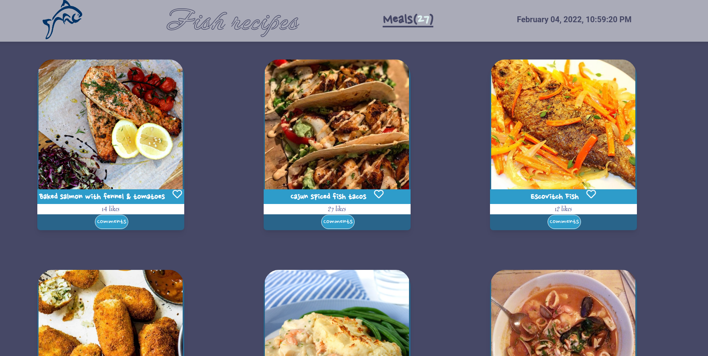

# Capstone 2 Javascript
## Fish recipes

Live preview [here](https://vudej.github.io/Capstone-2-JavaScript/dist/). 

## Screenshots

## Contents
* [Homepage](#homepage)

## General info
This project is Microverse group project Capstone, module 2.
Retrieval data from API and used Involvement API for likes and comments.
Test for data retrieved from API and for comments.

## Technologies
Project is created with:
* HTML
* CSS
* Javascript
* webpack
* jest

	
## Setup
To run this project, install it locally using:
- cd Desktop
- git clone https://github.com/VuDej/Capstone-2-JavaScript.git
- npm install
- npm start 

## Author 1

👤 **Dejan Vujovic**

- Github : [@VuDej](https://github.com/VuDej)
- Twitter: [@DejanVuj](https://twitter.com/DejanVuj)
- LinkedIn : [@Dejan-Vujovic](https://www.linkedin.com/in/dejan-vujovic-5a0672225/)

👤 **Aniekan udo**

- GitHub: [@Anny85-code](https://github.com/Anny85-code)
- Twitter: [@Annyudo8](https://twitter.com/Anny_udo8)
- LinkedIn: [LinkedIn](https://www.linkedin.com/in/aniekan-udo-665b65213/)

## 🤝 Contributing

Contributions, issues, and feature requests are welcome!

Feel free to check the [issues page](https://github.com/VuDej/Capstone-2-JavaScript/issues/36).

## Show your support

Give a ⭐️ if you like this project!

## Acknowledgments

- A special thanks to Microverse.

## 📝 License

This project is [MIT](LICENSE) licensed.

## Contact
Created by [@VuDej](https://github.com/VuDej) and [@Anny85-code](https://github.com/Anny85-code).